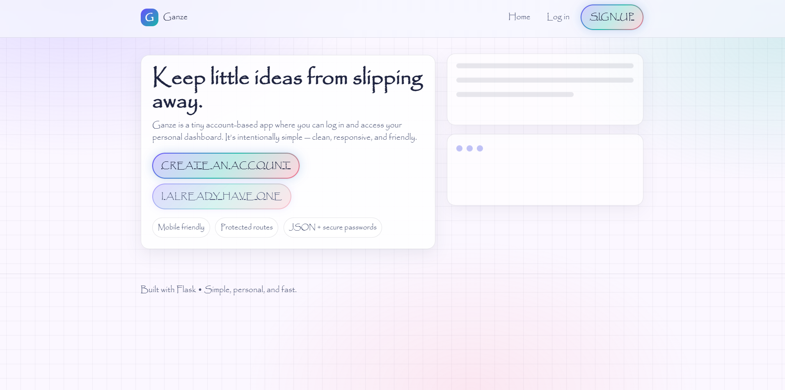
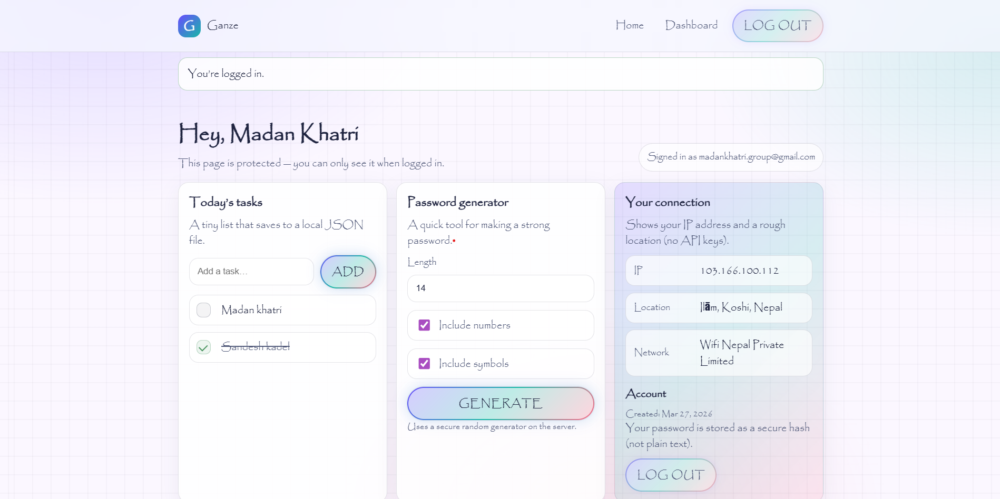

# Ganze: A Simple Flask App

This is a small web application built with Flask. It features a complete user authentication system (signup, login, logout) and a private dashboard for logged-in users.[**Click here for live demo**](https://ganze.onrender.com/)

All data, including users and their tasks, is stored in a simple `data/store.json` file, so there's no need for an external database.

## Features

- **User Authentication**: Secure sign-up and login. Passwords are never stored as plain text.
- **Protected Dashboard**: The main dashboard is only accessible after logging in.
- **Task Manager**: Add and toggle tasks. Your list is saved to your account.
- **Password Generator**: Create strong, random passwords on the server.
- **Connection Info**: Shows your public IP address and an estimated location.
- **Animated UI**: A clean, responsive design with subtle background animations.

## Screenshots

I've created a `screenshots/` folder for you. After running the app, you can place your images there.

### Screenshots

- **The landing page**


- **The user dashboard after logging in**


## How to Run

This project uses a virtual environment to keep its packages separate.

**1. Set up the Environment**

First, create and activate the virtual environment.

```powershell

python -m venv .venv

.\.venv\Scripts\Activate.ps1
```

**2. Install Packages**

With the environment active, install the required packages.

```powershell
pip install -r requirements.txt
```

**3. Run the App**

Now you can start the Flask server.

```powershell
flask run
```

The app will be running at `http://127.0.0.1:5000`.

## Project Structure

- `app.py`: The main Flask application file. Contains all routes and logic.
- `templates/`: Holds all the HTML pages.
- `static/`: Contains the CSS stylesheet and a favicon.
- `data/store.json`: The JSON file used as a simple database.
- `requirements.txt`: A list of all Python packages the project needs.

python app.py
```

Open: http://127.0.0.1:5000

## Routes

- `/` — Public home page
- `/signup` — Create an account
- `/login` — Log in
- `/dashboard` — Protected page (requires login)
- `/logout` — Logs out (POST)

## Notes for grading

- Data is stored in `data/store.json` and is created automatically the first time user sign up or add a task.
- Protected route behavior: if you visit `/dashboard` while logged out, you’ll be redirected to `/login`.
- IP/location is a best-effort lookup and may show “Local / unavailable” on some networks.

## Data format

The JSON file keeps two top-level keys:

- `users`: list of users with `id`, `name`, `email`, `password_hash`, `created_at`
- `tasks`: tasks grouped by user id
